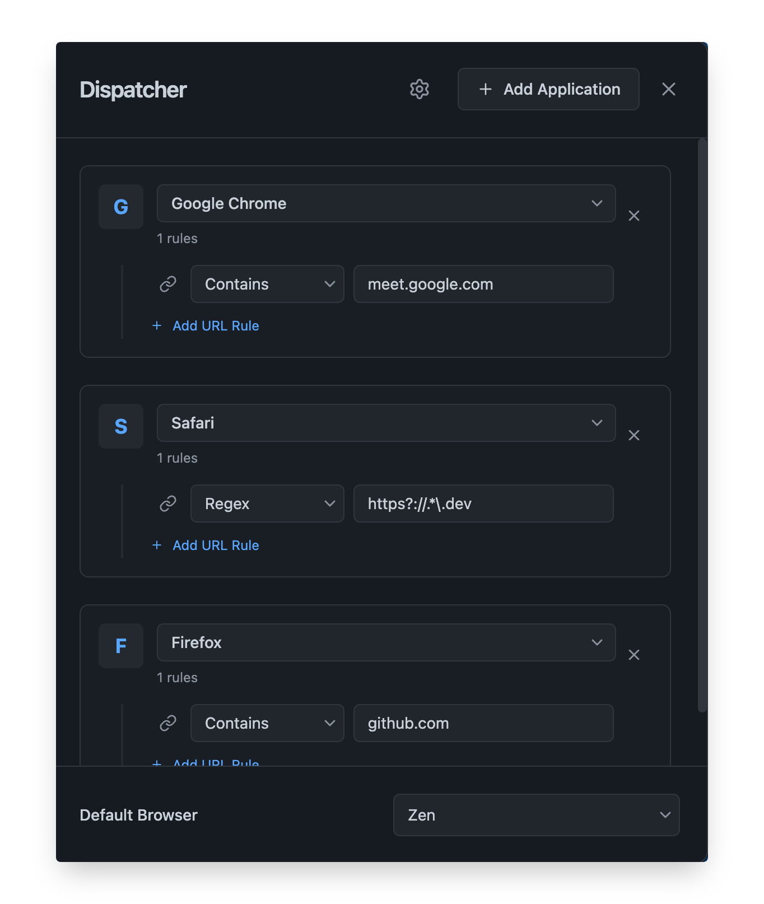

<div align="center">
  
  <h1>Dispatcher</h1>
</div>

**A smart, invisible URL router for macOS that automatically opens links in the right browser.**

Dispatcher is a lightweight menubar application that intelligently routes URLs to different browsers based on custom rules. It runs silently in the background, intercepts HTTP/HTTPS links, and dispatches them to the appropriate application without any visual interruption.

<p align="center">
  
</p>


## Why Dispatcher?

Do you use multiple browsers for different purposes? Perhaps Chrome for work, Firefox for personal browsing, and Safari for testing? Dispatcher eliminates the friction of manually copying URLs between browsers by automatically routing them based on your defined rules.

### Key Benefits

- **Seamless Routing**: Automatically open URLs in the right browser based on domain, pattern, or custom rules
- **Truly Invisible**: Runs as a menubar app with no Dock icon or window flashes
- **Zero Interruption**: Works completely in the background without disrupting your workflow
- **Flexible Rules**: Support for contains, starts with, and regex pattern matching

## Features

### 🎯 Smart URL Routing

Create custom rules to route URLs to specific browsers:
- **Contains**: Match URLs containing specific text (e.g., `github.com` → Chrome)
- **Starts With**: Match URLs by prefix (e.g., `https://meet.google.com` → Firefox)
- **Regex**: Advanced pattern matching for complex routing logic

### 🔧 Multi-Browser Support

- Automatically detects installed applications on macOS
- Support for any browser or application that can handle URLs
- Set a default browser for unmatched URLs

### 🎨 Modern Interface

- Clean, minimal UI for managing routing rules
- Dark theme with glassmorphism aesthetics
- Keyboard shortcuts for power users

### ⚙️ Settings & Customization

- **Start at Login**: Launch automatically when you log in
- **Test Mode**: Test your routing rules before they go live
- **Browser Groups**: Organize rules by application
- **Quick Access**: Access settings via menubar icon or `Cmd+,`

### 🚀 Background Operation

- Intercepts `http://` and `https://` protocol handlers
- Processes URLs without showing windows or Dock icons
- Stays hidden from Cmd+Tab switcher
- System tray/menubar only interface

## Releases

Pre-built binaries for macOS are available on the [GitHub Releases](https://github.com/owpac/dispatcher/releases) page.

**To install:**
1. Download the latest `.zip` file for macOS
2. Extract the archive
3. Move `Dispatcher.app` to your Applications folder
4. Launch the app (you may need to right-click and select "Open" on first launch)

### For Contributors

This project uses [Conventional Commits](https://www.conventionalcommits.org/) for automated versioning:
- `feat:` for new features (minor version bump)
- `fix:` for bug fixes (patch version bump)  
- `feat!:` or `fix!:` for breaking changes (major version bump)

## Installation

### From Source

1. Clone this repository:
   ```bash
   git clone https://github.com/owpac/dispatcher.git
   cd dispatcher
   ```

2. Install dependencies:
   ```bash
   npm install
   ```

3. Run in development mode:
   ```bash
   npm start
   ```

4. Build the application:
   ```bash
   npm run make
   ```

The packaged application will be in the `out` directory.

## Usage

### Setting Up Rules

1. Click the **Dispatcher** menubar icon and select "Settings"
2. Click **"Add Application"** to create a new browser group
3. Select the target browser from the dropdown
4. Click **"Add URL Rule"** to create routing rules
5. Enter the URL pattern and select the matching condition:
   - **Contains**: URL must contain the specified text
   - **Starts With**: URL must begin with the specified text
   - **Regex**: URL must match the regular expression

### Example Rules

- Route all GitHub links to Chrome:
  - Pattern: `github.com`
  - Condition: Contains
  - Browser: Google Chrome

- Route Google Meet to Firefox:
  - Pattern: `https://meet.google.com`
  - Condition: Starts With
  - Browser: Firefox

- Route all `.dev` domains to Safari:
  - Pattern: `https?://.*\.dev`
  - Condition: Regex
  - Browser: Safari

### Testing Rules

1. Enable **"URL Testing"** in Settings
2. Enter a test URL in the input field at the bottom
3. Click **"Test"** or press Enter
4. Dispatcher will open the URL in the matched browser

### Keyboard Shortcuts

- `Cmd+,` - Open Settings
- `Cmd+N` - Add New Application Group
- `Esc` - Close Settings Modal

## Technical Details

### Built With

- **Electron** - Cross-platform desktop framework
- **React** - UI component library
- **TypeScript** - Type-safe JavaScript
- **Tailwind CSS** - Utility-first CSS framework
- **Vite** - Fast build tool and dev server

### How It Works

1. Dispatcher registers itself as the default handler for `http://` and `https://` protocols
2. When you click a link, macOS sends it to Dispatcher via the `open-url` event
3. The renderer process evaluates your rules to find a match
4. If a match is found, the URL opens in the specified browser; otherwise, it uses the default browser
5. Dispatcher immediately hides itself to maintain invisible operation

### Platform Support

- **macOS**: Full support (primary platform)
- **Windows**: Partial support (URL routing works, some UI features may differ)
- **Linux**: Partial support (URL routing works, some UI features may differ)

## Configuration

All settings are stored in `localStorage`:
- **Routes**: URL routing rules
- **Default Browser**: Fallback browser for unmatched URLs
- **Settings**: UI preferences and feature toggles

Configuration persists across app restarts and updates.

## Development

### Project Structure

```
dispatcher/
├── src/
│   ├── main.ts              # Electron main process
│   ├── preload.ts           # Preload script for IPC
│   ├── renderer.tsx         # React entry point
│   ├── components/          # React components
│   │   ├── Dispatcher.tsx   # Main UI component
│   │   └── RouteItem.tsx    # Individual route editor
│   ├── services/            # Application services
│   └── types/               # TypeScript type definitions
├── assets/                  # Icons and images
├── forge.config.ts          # Electron Forge configuration
└── package.json             # Dependencies and scripts
```

### Available Scripts

- `npm start` - Run in development mode
- `npm run package` - Package the app
- `npm run make` - Build distributables
- `npm run lint` - Run ESLint

## Contributing

Contributions are welcome! Please feel free to submit a Pull Request.

## License

This project is licensed under the GNU General Public License v3.0 - see the [LICENSE](LICENSE) file for details.

**GPL v3** ensures that Dispatcher and any derivative works remain free and open source.

---

**Made with ❤️ for multi-browser workflows**
